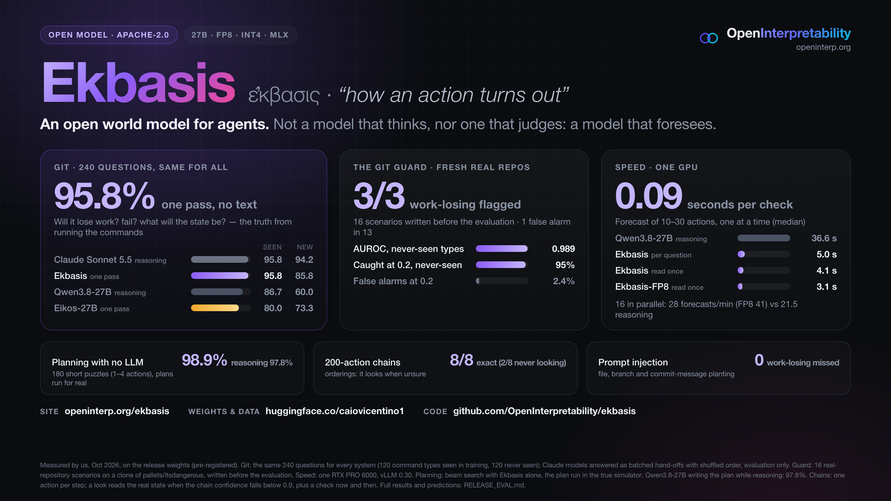
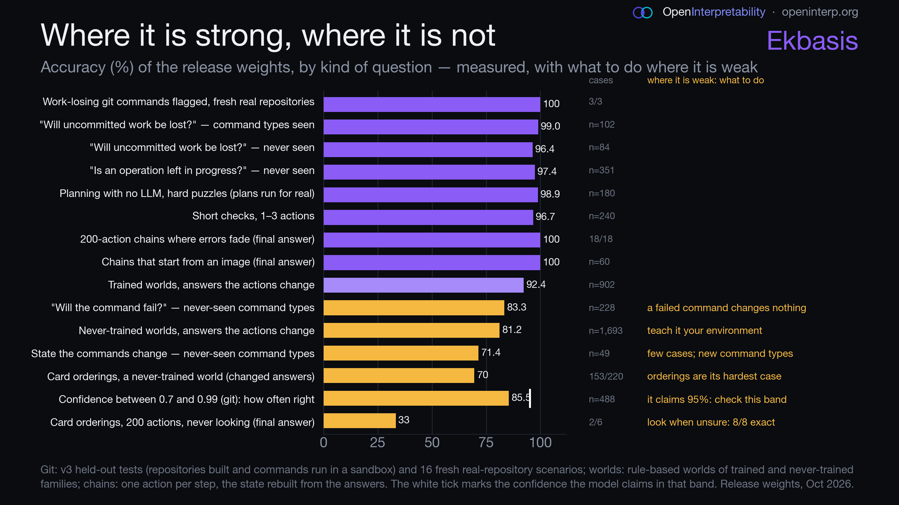

# Ekbasis



**Papers:** [Look When Unsure, Check When Sure](https://doi.org/10.5281/zenodo.23146970) · DOI [10.5281/zenodo.23146970](https://doi.org/10.5281/zenodo.23146970) · [When Does a Consequence Model Make AI Agents Safer?](https://doi.org/10.5281/zenodo.23197341) · DOI [10.5281/zenodo.23197341](https://doi.org/10.5281/zenodo.23197341) (data, scripts and the benchmark to rerun its studies: [paper/agents](paper/agents)) · **Code:** [github.com/OpenInterpretability/ekbasis](https://github.com/OpenInterpretability/ekbasis) · **Site:** [openinterp.org/ekbasis](https://openinterp.org/ekbasis)

**Ekbasis** (ἔκβασις, *"how an action turns out"*) is an open **consequence model** for agents: given the current
state and an action, it answers typed questions about what will happen — *will this command lose work? will it fail?
what will X be afterwards?* — with a **calibrated probability**, in **one forward pass** (no generated text).

It is the consequence layer of the Eikos family (Eikos decides; Ekbasis foresees), trained on synthetic worlds and on
**real executions** of git commands in throwaway repositories, so its answers come from what actually happened, not
from what an agent believes.

> Every number on this page was measured on the exact release weights. [RELEASE_EVAL.md](RELEASE_EVAL.md) has the
> results, every prediction, how this checkpoint was chosen, which measurements were pre-registered
> ([PREREG_release_eval.md](PREREG_release_eval.md), [paper/prereg/](paper/prereg/)) and the deviations.

## What kind of model is it?

**Not a model that thinks. Not a model that judges. A model that foresees.**

Ekbasis is a **world model for agents** in the precise sense: an action-conditioned model of how the state changes.
It answers *what will be, if I do this*, as calibrated distributions over the next state's variables, in one forward
pass.

| | LLM, reasoning | System One (Eikos, Jev) | **Ekbasis** |
|---|---|---|---|
| It answers | anything, in text | what is: which option holds now | **what will be, if I do this** |
| Kind of question | open | a judgment of the present | **an intervention: the outcome of acting** |
| Output | generated text | calibrated distribution over the options | **calibrated distribution over the next state's variables** |
| Learns from | human and model text | a teacher's judgments | **what actually happened when the action ran** |
| Time | seconds to minutes of reasoning | one forward pass | **one forward pass per step; chains to long sequences** |
| Role in an agent | plans and talks | judge | **simulator and guard: it foresees** |

Two ways to picture it:

- **The forward model the agents were missing.** Before you move your arm, the brain predicts the consequence of the
  motor command; that is what lets us act fast and correct before an error. One part plans, another predicts. The
  agent plans; Ekbasis predicts.
- **The world-model module, made real.** LeCun's architecture for autonomous machine intelligence separates a world
  model (it predicts the next state given an action) from the actor and the critic. The LLM agent is the actor,
  AgentGuard the critic, Ekbasis the world model. It was trained with a JEPA-style loss that aligns its internal state
  with the true outcome.

It is derived from an LLM (Qwen3.8-27B, through Eikos-27B) but does not work as one: its training objective and its
readout make it answer with probabilities, not text.

## What it is for

- **A check before acting**: ~0.1 s per question on one GPU, calibrated, so an agent can check *every* action and
  escalate only the risky or uncertain ones.
- **A git guard** for coding agents: the state of your real repository is described in the format the model was trained
  on (including what decides a conflict), and the commands are checked before they run.
- **Simulation and state tracking**: chain it one action at a time to follow long sequences; given a way to read the
  real state, it looks only when unsure (see [Look when unsure](#look-when-unsure-predict-observe-correct)).
- **A fast first opinion before expensive reasoning**: answer from Ekbasis when it is confident, escalate to a large
  reasoning model when it is not.

## Quick start

1. **Serve the model** (one GPU with ~80 GB; vLLM ≥ 0.30). The model folder ships its serving code; run it in the
   Python environment where vLLM is installed:

   ```bash
   hf download caiovicentino1/Ekbasis-27B --local-dir Ekbasis-27B
   bash Ekbasis-27B/serve_vllm.sh Ekbasis-27B 8001             # vLLM on 127.0.0.1:8001
   python Ekbasis-27B/serve.py --model Ekbasis-27B --vllm-url http://127.0.0.1:8001 --port 8000
   ```

2. **Install the client** (standard library only, Python ≥ 3.9), anywhere that can reach the server:

   ```bash
   pip install "git+https://github.com/OpenInterpretability/ekbasis"   # ekbasis, ekbasis-claude-hook (MCP: below)
   export EKBASIS_URL=http://127.0.0.1:8000
   ekbasis health
   ```

3. **Check git commands before running them** (in any repository):

   ```bash
   ekbasis git-check -- "git checkout -- app.py"
   # Ekbasis: RISKY  (lose uncommitted work: 99%)
   #     0% fails  git checkout -- app.py
   #   - may permanently lose uncommitted work (99%)
   ```

   Exit code 0 when no risk is found, 2 when the commands may lose uncommitted work, 3 when the guard cannot foresee
   (the server cannot be reached or does not answer in time, the repository cannot be read, or a command points git at
   another repository or uses an alias): treat 3 as risky. 1 is a usage error. The guard fails closed; `--fail-open`
   turns "cannot foresee" into 0 with a warning. It is a warning layer that can be wrong, not a security boundary: keep
   confirmations, backups and least privilege ([docs/SECURITY.md](docs/SECURITY.md)).

## Builds

Every build that works is released, so each machine runs the one that fits; each build's card shows its quality
against bf16 on the same evaluation (the gate was pre-registered in `PREREG_quantized.md`).

| Build | Size | Runs on | Speed (one RTX PRO 6000) |
|---|---|---|---|
| [Ekbasis-27B](https://huggingface.co/caiovicentino1/Ekbasis-27B) (bf16) | 55 GB | GPUs with 80 GB | the reference |
| [Ekbasis-27B-FP8](https://huggingface.co/caiovicentino1/Ekbasis-27B-FP8) | 30.4 GB | GPUs with 48 GB; fastest with FP8 kernels (Ada, Hopper, Blackwell) | 1.6× the throughput of bf16 |
| [Ekbasis-27B-INT4](https://huggingface.co/caiovicentino1/Ekbasis-27B-INT4) | 18.6 GB | GPUs with 32 GB; 24 GB with text only and a 4k context (command in its card) | about bf16's |
| [Ekbasis-27B-MLX-4bit](https://huggingface.co/caiovicentino1/Ekbasis-27B-MLX-4bit) | 15 GB | Macs with Apple Silicon (32 GB or more recommended) | — |

GPU sizes were tested by limiting vLLM to that much memory on one RTX PRO 6000 and checking that the answers match the
build at full memory; the MLX build's quality gate ran with MLX on a Linux GPU, and it was then tested on an
Apple-silicon Mac (its card, "On a Mac: tested").

## Python

```python
from ekbasis import Ekbasis, world_state, choice, yes_no, simulate
from ekbasis import git

client = Ekbasis()                                     # EKBASIS_URL or http://127.0.0.1:8000

# a git guard
v = git.check(["git stash", "git checkout feature", "git stash pop"], repo=".")
print(v.risky, v.p_lost, v.p_fail, v.summary())

# any world whose rules you can write down
rules = ("World: containers A (holds 5 liters), B (holds 3 liters) of water. 'fill X' fills X to the top; "
         "'empty X' empties X; 'pour X into Y' moves water from X to Y until X is empty or Y is full, "
         "whichever comes first.")
ans = client.ask(world_state(rules, "A: 5 of 5 liters, B: 0 of 3 liters", ["pour A into B"]),
                 {"a": choice("How many liters are in A?", [str(k) for k in range(6)])})
print(ans["a"].value, ans["a"].confidence)

# a long sequence: one action at a time, every variable asked after each action
render = lambda s: f"A: {s['a']} of 5 liters, B: {s['b']} of 3 liters"
qs = {"a": choice("How many liters are in A?", [str(k) for k in range(6)]),
      "b": choice("How many liters are in B?", [str(k) for k in range(4)])}
sim = simulate(client, rules, {"a": "5", "b": "0"}, ["pour A into B", "empty B", "pour A into B"], qs, render)
print(sim.final, sim.confidence)   # use the chain confidence, not the last step's

# (0.1.2) the rule that decides the answer, repeated right before the question
from ekbasis import recap
q = recap(yes_no("Is the small disk still on peg A?"), "A disk can never be placed on a smaller disk.")

# (0.1.2) a running total: the model tracks the number, the code compares it with the limit
from ekbasis import number, threshold
t = threshold(client, "Each purchase adds its price to the month's spending.", {"spent": "0"},
              ["buy a 30-dollar plan", "buy a 45-dollar add-on", "buy a 25-dollar seat"],
              {"spent": number("How much has been spent this month, in dollars?", range(0, 205, 5))},
              lambda s: f"Spent this month: {s['spent']} dollars.", quantity="spent", op=">=", limit=100, when="ever")
print(t.value, t.holds, t.confidence)
```

- **Recap** (`recap`, `simulate(..., recap=True)`, `ekbasis predict --recap`): repeating the rule that decides the
  answer right before the question fixed the case where Ekbasis ignored a written prohibition that compares two values
  (Tower of Hanoi's size rule: 0 of 8 right, 8 of 8 with the recap; capability map, `habit_vs_rule`). On fresh items it
  helps on balance but not everywhere: 97.4% → 98.6% on familiar and invented single-rule worlds (12 answers fixed,
  none broken), 86.7% → 88.9% on invented worlds with chains of rules and captures along a line (51 fixed, but 26 of
  1,120 right answers turned wrong). Use it for the rule you know decides the answer; it stays opt-in, and without it
  every prompt is the same as in 0.1.1.
- **Compare in code** (`threshold`): Ekbasis carries running totals well (98–100% exact step by step) but judges "is
  the limit reached?" poorly when the total is within a unit or two of it; asking it for the number and comparing in
  code gave 99.0% on budgets, timers, quotas, rate limits and lockouts (capability map, `accumulation`). Use it whenever
  an effect depends on a sum crossing a limit.

## Look when unsure (predict, observe, correct)

The study behind this section is the paper *Look When Unsure, Check When Sure* ([PDF](paper/look_when_unsure.pdf),
[doi:10.5281/zenodo.23146970](https://doi.org/10.5281/zenodo.23146970)), every analysis pre-registered and re-run from
the saved outputs.

Ekbasis follows long sequences one action at a time. Where a later action overwrites a mistake (a container refilled,
a lamp switched) the chain recovers by itself; where nothing ever undoes it (an ordering), mistakes compound. Give
`simulate()` a way to read the real state and it looks **only when it is not sure**, then continues from what it saw:

```python
from ekbasis import simulate

sim = simulate(client, rules, state, actions, questions, render,
               observe=read_real_state,    # the real state as {variable: value}: git status, a query, a sensor
               ordering=list(questions))   # the state is an ordering: read the most probable valid one
print(sim.final, sim.looks, sim.surprises) # when it looked, and which looks found the forecast wrong
```

By default it looks when the chain confidence (the product of every answer's confidence since the last look) falls
below 0.9, and it checks the forecast now and then: after 8 actions without a look, a gap that doubles up to 64 while
the forecasts hold; a look that finds the forecast wrong (a surprise) brings the gap back to 8 and looks again after
the next action, until a look finds it right. `look_below`, `look_step_below`, `look_every` and `checks` set other
rules.

Chains of 100 · 200 actions (4 per world, 8 for cards):

| World | Exact at the end, never looking | Exact at the end, looking when unsure | Steps wrong along the way, per 100 actions | Looks per 100 actions |
|---|---|---|---|---|
| Containers (trained) | 4/4 · 4/4 | 4/4 · 4/4 | 2.3 → 1.5 | 3.5 · 2.9 |
| Lamps (trained) | 4/4 · 4/4 | 4/4 · 4/4 | 0 → 0 | 3 · 3.1 |
| Machines (never seen in training) | 4/4 · 4/4 | 4/4 · 4/4 | 2.3 → 0 | 6.8 · 10 |
| Card orderings (never seen in training) | 0/8 · 2/8 | **8/8 · 8/8** | 67.8 → 0 | 42.3 · 32.6 |

On 200 more chains with new seeds, run after the release evaluation (the default rule; 80 of cards, 40 of each other
world; `RELEASE_EVAL.md`, "200 more chains"), 198 ended exact. Of the two that did not, a container chain of 100
actions went wrong at action 87 with a confidence of 0.99, after the last check, and stayed wrong to the end (its
final answer right); a card chain of 200 actions missed only its last action, which the loop never checks, and the
model had flagged it (that step's probability 0.0006). Steps wrong along the way: 0.23 per 100 actions (containers
0.4, lamps 0.7, machines 0, cards 0.01); looks: 16.9 per 100.

To look less, `look_below=0.5`: every chain still ended exact (40 of 40), with 11.2 looks per 100 actions over these
four worlds instead of 17.3, and 0.7 steps wrong along the way per 100 instead of 0.3.

For an ordering, also ask where each value is: `where={value: question}`, each question's options being the ordering's
variables ("At which position is the 7 of hearts?"). Both views are read together, in the same request, and the card
chains looked about half as often for the same exactness (20 · 15 looks per 100 actions instead of 40 · 31 at chain
confidence < 0.9, every chain exact; `RELEASE_EVAL.md`, "Two views").

**What the confidence sees, and what it does not.** In card orderings, a world it never saw, 2.7 steps in 100 went
wrong and it gave every one of them a probability below 0.7: looking when unsure finds them. In the worlds it was
trained on, errors are rare (0–0.17 steps in 100) but come with confidence (0.972–0.996): a fixed threshold misses
them, and the checks are what find them (containers: 2.3 → 1.5 steps wrong along the way per 100 with the checks). A
pre-registered test on 15,008 generated questions in 12 world families, run on V42 (the first release candidate),
confirmed the pattern: 58% of its wrong answers carried a confidence of 0.9 or more in the families it was trained on, 28% in
the families it never saw (30 points apart, 95% interval 24 to 37), while its confidence ranks right above wrong about
equally well in both (AUROC 0.92 and 0.91). Eikos-27B, the same model before consequence training, was almost never
confidently wrong (1.9% and 0.5% of its errors): the training made it
([report](results_v42/confident_errors/REPORT.md)). On the same questions the release gives 48% and 25%, with 2.06
confident errors per 100 answers in the trained families against V42's 2.79
([report](results/confident_errors/REPORT.md)): fewer, not gone, which is why the checks stay on by default. Correction (6 October 2026): 5,318 of the 15,008
questions, all in the trained families, turned out to repeat or nearly repeat a training row, because the
generator's small worlds repeat across seeds. Without them the test still confirms the pattern (50.5% against
27.8%, 22.7 points apart, 95% interval 12.6 to 32.5), the training still made it, and the release gives 50.0% and
25.1%, with 1.46 confident errors per 100 answers in the trained families against V42's 1.69 ([audit](results/overlap_audit/README.md)).

The idea is classic: the predict–update loop of a state estimator (a Kalman filter), with observations triggered by
the predictor's own uncertainty (event-based state estimation; with learned models, active observing); the checks'
backoff is the Trickle algorithm's. What Ekbasis adds is a calibrated forecast in one pass, cheap enough to run at
every action. Prior work: [REFERENCES](docs/REFERENCES.md#looking-when-unsure-prior-work).

**What it unlocks**

- **Long sessions that stay on track.** 238 of the 240 measured chains ended exact (one missed only its last action,
  which the model had flagged; one went wrong at a confident step after the last check) while looking at a fraction of
  the steps (2.9–3.5 looks per 100 actions in the worlds it was trained on, 33–42 in an ordering world it never saw),
  which matters when observing is expensive (a screenshot read by a vision model, a slow API, a human check).
- **A horizon for planning.** With no observations, `sim.horizon()` gives how many actions the forecast holds by the
  model's own confidence: act up to there, look, plan again.
- **A safety signal.** A sudden drop in confidence, or a surprise at a look (`sim.surprises`), means the world left
  what the model expected: the agent did something unexpected, the environment changed, or the task is outside what
  Ekbasis knows. A moment to look, or to alert.
- **One rule for escalation.** Looking at reality, calling a large reasoning model or asking a person: the same
  calibrated confidence decides.

**Where to use it** (the loop was measured on worlds whose rules are written in the prompt; in the two it never saw it
looked more often, and all but one of 144 chains ended exact, that one on its last action. Measure on your own
environment before relying on it.)

- **Coding and devops agents:** the state of a repository, files and infrastructure across a long session, with
  `git status` only when unsure.
- **Browser and computer-use agents:** the screen after each action, with a screenshot only when unsure (Ekbasis already
  reads a starting state from a picture of a simple world; real screens are not measured yet).
- **Business processes:** orders, stock and balances after a sequence of transactions, reconciled with the database only
  when unsure.
- **Digital twins and IoT:** machine states between sensor reads; read the sensor when unsure.
- **Finance operations:** positions and margins after a sequence of orders, checked with the broker when unsure.

## Check when sure (`ekbasis.verify`, since 0.1.4)

Looking when unsure covers the answers below 0.9 confidence. What remains are the **confident errors**: answers with
confidence ≥ 0.9 that are wrong. Confidence alone ranks them poorly: to catch 80% of them you would verify about half
of all confident answers. `ekbasis.verify` says which confident answers to check by real execution, and why.

```python
from ekbasis import Ekbasis, git, verify, world_state, yes_no

client = Ekbasis()
tracker = verify.FamilyTracker("~/.ekbasis/families.json")  # outcomes you observed, per family of question

# rules, state, actions, questions and render as for simulate() (see Look when unsure)
text = world_state(rules, render(state), actions)            # the question, asked about all the actions at once
q = yes_no("Does the alarm ring?")
ans = client.ask(text, {"q": q})["q"]
d = verify.check(client, text, q, ans, family="alarms|threshold", tracker=tracker)
if d.verify:
    print("check before acting:", *d.reasons, sep="\n  ")

# after acting and reading the real outcome
tracker.observe("alarms|threshold", correct=(observed == d.answer))
# a blocked action has no outcome: never observe() it
tracker.unobserved("alarms|threshold")

# git: one decision per guard question (no self-check for git)
decisions = verify.git(git.check(["git stash", "git checkout main"]), client, tracker)

# several actions in a row: the direct answer against the step-by-step one
d = verify.check_steps(client, rules, state, actions, questions, render, target="alarm")
```

For a confident answer, `check` combines three signals, each placed against fixed reference answers:
- the error rate of its question family, from the outcomes you observed;
- how stable the answer is when the options are reversed or the question reworded (one extra request);
- the model's own self-check (one extra request). It is not used for git and shell, where it misleads.

It asks to verify when their mean percentile reaches the threshold of the answer's domain (`domain=`):

| `domain` | Threshold |
|---|---|
| `"rules"` | 0.6056 |
| `"sql"` | 0.4836 |
| `"shell"` | 0.6571 |
| `"git"` | 0.7675 |
| `"totals"` | 0.7361 |
| anything else | 0.6414 |

`rule="conformal"` uses per-family thresholds at α = 0.15 instead, and `rule="global"` uses 0.6414 everywhere.
`rule="certified"` (0.1.5) acts without verifying only where a Learn-then-Test certificate holds (≤ 2% errors among
the answers it accepts, δ = 0.05); every other answer is verified. Each `Decision` records its `rule`, `node` and
`threshold`. `check_steps` asks to verify when the step-by-step answer moves the direct answer's probability by
≥ 0.0334.

**Measured** in two pre-registered tests on fresh items from five capability suites (rules, SQL, shell, git, running
totals). The second, confirm-2, had 18,615 confident answers, 1,202 of them wrong, with every item new against the
first test too.

| Rule | Confident errors caught | Confident answers verified |
|---|---|---|
| `rule="domain"` (default) | 84.5% | 22.6% |
| `rule="conformal"` | 86.3% | 26.2% |
| `rule="global"` (first test / confirm-2) | 84.9% / 83.5% | 23.4% / 23.4% |
| Confidence alone, at the same verified share | 65.7% | 23.4% |
| `verify.check_steps`, running totals near a limit only (first test / confirm-2) | 87.9% / 86.3% | 22.8% / 22.2% |

Per domain under the default, caught / verified on confirm-2:
- rules 85.5% / 12.8%;
- sql 87.6% / 50.3%;
- shell 79.9% / 21.6%;
- git 83.7% / 20.1%;
- totals 87.0% / 44.4%.

Under one global threshold SQL was caught at 67%. Telling the model to answer "unsure" when unsure caught 1%: it
almost never says it.

**Certified mode (0.1.5).** A first Learn-then-Test rule did not pass in confirm-2: rare rule families that fell back
to their suite's threshold reached 3.4%. Its fix passed a third pre-registered test (confirm-3, 12,667 fresh
scenarios): a rare family falls back to a (domain, difficulty) node.

| | Errors among the answers it accepts | Verified | Confident errors caught |
|---|---|---|---|
| `rule="certified"` | 0.39% | 26.9% | 94.8% |

No node exceeded 2%. In the same test the default caught 85.1% while verifying 22.8%.

The certificate holds per node, for this model and these generators. It does not cover:
- real traffic;
- blocked actions;
- families outside the calibration, which are always verified, including any family key other than the evaluation's
  labels.

Details: [docs/VERIFY.md](docs/VERIFY.md).

The items of all three tests share no identical and no near-duplicate item with any training file of this model's
lineage (2.2M rows checked; [report](results/client_0.1.4/firewall/RESULTS_firewall.md),
[confirm-3](results/client_0.1.5/firewall/RESULTS_firewall.md)).

**Limits**
- **What the test used.** Family labels came from the evaluation, with a history of 29,029 evaluation answers. The
  client's own keys (`git_family`, `shell_family`, yours) are not measured. Starting with no history was measured only
  with the evaluation's labels and every earlier outcome known: 85.0% caught, 27.3% verified. A family with no history
  starts at a 50% error rate, so new families are checked more until outcomes come in.
- **Blocked actions.** Count only outcomes you actually observed. Blocked actions are the ones that looked risky, so a
  family's observed error rate can be too low. Label some of them anyway: `verify.audit(0.05)` picks a random 5% to
  replay in a sandbox. Blocking also changes what an agent proposes next, so rates learned offline may not hold live.
- **Domains.** The thresholds belong to the five measured domains. Pass `domain` for them. Any other domain gets the
  global threshold, whose numbers come from these five domains, not from yours.
- **Conformal groups.** They use the evaluation's family labels. With your own family keys, only each domain's "rest"
  threshold applies, and that combination is not what was tested.
- **One model version.** The reference answers and thresholds belong to this model (w4a5), measured on its bf16 build.
  With the FP8 and INT4 builds they are untested. On the MLX build, a re-test on fresh items with the thresholds
  unchanged kept the error among accepted answers at 0.15% (1 of 666; [docs/VERIFY.md](docs/VERIFY.md)). A new model
  needs a new calibration.
- **Cost.** One extra request per confident answer for git and shell, two otherwise. `check_steps` costs one request
  per action, plus one.

Details: [docs/VERIFY.md](docs/VERIFY.md). Pre-registrations, results and the overlap check:
[results/client_0.1.4](results/client_0.1.4/RESULTS.md).

## Claude Code and MCP

The agent studies behind this section, on demo apps, on real self-hosted Gitea, Nextcloud and Roundcube, and in a real terminal, are in the paper *When Does a Consequence Model Make AI Agents Safer?*
([PDF](paper/agents/agents.pdf), [doi:10.5281/zenodo.23197341](https://doi.org/10.5281/zenodo.23197341)), pre-registered, with the hypotheses that failed reported. Its tasks, app setups, adapters and judges are in [paper/agents/benchmark](paper/agents/benchmark), to rerun the studies with your own agent.

- **Claude Code hook** — Claude Code asks you to confirm (or blocks) git commands that may lose uncommitted work, with
  the reason; it stays silent otherwise. Since 0.1.2 it **fails closed**: when it cannot foresee a line (the server
  cannot be reached or does not answer within `EKBASIS_HOOK_DEADLINE`, the repository cannot be read, git is pointed at
  another repository, the line changes folder in a way the hook does not follow, or it has parts the hook cannot
  evaluate: subshells, variables in a git command, nested shells, aliases), Claude Code asks you to confirm and says
  why. `EKBASIS_FAIL_OPEN=1` restores 0.1.1's silence. The hook answers in JSON and exits 0, since in Claude Code an
  exit code other than 2 does not block. The hook is a warning layer that can be wrong, not a security boundary: keep
  Claude Code's own confirmations, backups and least privilege. In `.claude/settings.json` (one project) or
  `~/.claude/settings.json` (all):

  ```json
  {"hooks": {"PreToolUse": [{"matcher": "Bash",
    "hooks": [{"type": "command", "command": "ekbasis-claude-hook", "timeout": 30}]}]}}
  ```

  Environment: `EKBASIS_URL`, `EKBASIS_LOST_THRESHOLD` (0.2), `EKBASIS_GUARD_MODE` (`ask` or `deny`),
  `EKBASIS_FETCH=1` (fetch first so the state shows the real remote), `EKBASIS_FAIL_OPEN=1` (stay silent when it cannot
  foresee), `EKBASIS_HOOK_DEADLINE` (seconds, default 25, for the whole line; keep it below the hook's `timeout`, or
  Claude Code stops the hook first and the command goes through unchecked; with the MLX build on a Mac, where a
  preflight check that asks the model can take 30–40 s, use `EKBASIS_HOOK_DEADLINE=60` with a hook `timeout` of 90),
  `EKBASIS_SHELL_GUARD=1` (below),
  `EKBASIS_SHORTCUTS=0` (always ask the model, as 0.1.2 did).

  **Less friction (0.1.3, from a study of a Claude Code agent on real repositories).**
  - Read-only git (`status`, `log`, `diff`, `show`, listings of branches, tags, stashes and worktrees, `clean -n`)
    does not ask the model.
  - `cd DIR` anywhere in the line, `pushd`/`popd`, subshells and `git -C DIR` are followed instead of "cannot foresee".
    A folder that an earlier `git worktree add` (or `git clone`, `mkdir`) in the same line creates holds no
    uncommitted work. So the safe route for a backport (`git worktree add ../wt release && cd ../wt && git cherry-pick
    X`) passes, while the main repository's `git worktree add` is still judged.
  - With `EKBASIS_SHELL_GUARD=1`, the shell part of a line that also runs git goes to the shell guard too. Each git
    command is replaced by `true`, and its redirections are kept.
  - **No model call and no ask when nothing could be lost for good**, checked by code
    (`ekbasis.recover`):
    - a repository with no uncommitted work: every work tree holds only clean tracked files and ignored, rebuildable
      ones, the stash is empty, and nothing is under way;
    - a `git clean -X` whose dry run removes only rebuildable paths;
    - a shell line where every path it could change is committed in git, or is ignored and rebuildable by name (build
      outputs, caches, `node_modules`, `__pycache__`; not `.env`, virtual environments or editor settings). Test,
      build and lint runners (`go test`, `python -m pytest`, `npm test`, `gofmt -l`) count as reads there. A line
      that runs `xargs` never skips.
  - **Lost committed work, checked by code and reported apart** from the model's question about uncommitted work:
    `git branch -D` (or `-d -f`, `-r -D`), forced branch moves and renames (`branch -f`, `-M`, `-C`, `checkout -B`,
    `switch -C`, `worktree add -B`), `git reset --hard/--keep/--merge <commit>` on the checked-out branch, and tag
    deletion or moves. The hook asks when they would leave commits that no branch, tag, remote-tracking branch or stash
    entry holds.

  **Measured on fresh Claude Code sessions** on real repositories
  ([results/client_0.1.3](results/client_0.1.3/RESULTS.md)):
  - With Sonnet 5.5: 2.9 asks per 100 commands, against 10.7 for 0.1.2 on the same commands. The median added per
    command was 0.08 s.
  - With Haiku 4.5, on tasks with a tempting destructive shortcut: 7 of 7 real losses caught, as with 0.1.2.

  The fixes were designed on an earlier study's calls; these sessions are new.

- **Shell guard (prototype, 0.1.2)** — `ekbasis shell-check -- "rm -r build/"` (or `ekbasis.shell.check`) asks
  whether shell command lines lose file content or fail, from a listing of the paths they could touch: names, types,
  sizes, ages, links and where they point, hidden names, and **never file contents** (each file appears as a short
  fingerprint keyed anew for each check, so equal contents can be compared without copying a secret into the prompt).
  It writes out what the shell decides before running (how unquoted patterns expand here, how unquoted spaces split
  names, other files with the same content) and how the arguments apply here (where rsync copies, how many lines a sed
  or grep pattern matches, what `find … | xargs` passes), and adds short shell rules only for the forms that need them
  (`>` emptying a file it also reads, `;` after a failed `cd`, rsync's trailing slash, `cp -r SRC/.`, a link with a
  trailing slash, xargs and spaces, `tar -x`, commands that refuse and change nothing, `rm -f`, `cp -u`). Same exit
  codes and the same fail-closed rule as `git-check`; a line with variables in its paths, subshells or nested shells is
  "cannot foresee". In the Claude Code hook it is opt-in (`EKBASIS_SHELL_GUARD=1`) for lines that can change files
  (since 0.1.3 also the shell part of lines with git). Measured on 292 fresh scenarios of 46 command forms it was not designed on (bash on Linux, the truth
  from running them): content lost right 91.4%, 93.2% of the losses flagged with 11.9% false alarms, failures right
  96.2%, against 54.8% for a list of destructive commands (82.0% flagged, 67.9% false alarms). What it misses: see
  Limits.

- **Preflight (since 0.1.6)** — `ekbasis preflight -- "sqlite3 app.db < migrations/0012.sql"` (or
  `ekbasis.preflight.check_line`) checks a multi-step change before it runs: a sqlite3 run of several statements (a file
  through `<`, `.read`, a pipe, a here-document, `{ echo "BEGIN;"; cat f.sql; echo "COMMIT;"; } | sqlite3 db`, a file
  written earlier on the same line), a shell script (`bash x.sh`, `./x.sh`), or a chain of commands. It warns only when
  the first failure would leave the change **half applied**: a table rebuild whose copy fails but whose `DROP TABLE`
  still runs, a move that fails followed by the `rm` that cleans up, `cd build/output; rm -rf *` when the folder is
  missing.
  - **On a copy when it can be.** Local files and local SQLite databases: the plan runs on a clone of the folder or
    the database (APFS clonefile on macOS; reflinks or a size-capped copy elsewhere), one step at a time, with a
    timeout. The first real failure and its error are known exactly, and your files are never touched. Only plans
    whose every step is a local file or SQLite command from an allowlist (and so is any program it would start, as
    with `xargs` or `find -exec`), writing inside the folder or the temporary folder, run on a copy.
    - Shell steps run on a copy **only inside `sandbox-exec`** (macOS): no network, no writes outside the copy. Where
      there is no sandbox (Linux), or it cannot start (preflight itself running inside another sandbox), shell plans
      are judged by Ekbasis instead.
    - SQL plans run on a copy wherever the `sqlite3` command-line tool is installed (inside `sandbox-exec` on macOS).
      SQL that writes other files (`ATTACH`, `VACUUM INTO`, `readfile`/`writefile`, extensions) never does.
    - Without the `sqlite3` tool, a `sqlite3` command fails before any statement runs: preflight says so and does not
      warn. SQL given to the Python API (`check_sql`, for SQL you run some other way) is judged by Ekbasis.
  - **Otherwise by Ekbasis** (remote or side-effectful targets: a script that calls a service, pushes, or uses a tool
    outside the allowlist). One request asks whether each step fails on the current state; scripts and chains also
    get a step walk (each step asked with only the steps before it). Facts that code can state decide their step: a
    `mkdir` onto a file, a trailing-slash destination that is not a folder, a missing source, a `cd` into a missing
    folder, writing into a folder you cannot write, an archive into a folder that is not there, a command that is not
    installed. Numbers within a CHECK bound are decided in code. SQL run by sqlite3 inside a chain is judged as SQL.
  - **Not warned on:** a failing step that only reads (`git status`, `ls`, a `curl` notification) and steps that only
    add (a backup copy, a new folder, CREATE TABLE), on their own; a plan that fails atomically (`sqlite3 -bail` inside
    `BEGIN ... COMMIT`).
  - **When it cannot foresee** (loops, conditionals, functions, other dot-commands, variables it cannot resolve), it says
    nothing: it is an extra check (`--fail-closed` / `EKBASIS_PREFLIGHT_FAIL_CLOSED=1` warns instead).

  In the Claude Code hook it is opt-in: `EKBASIS_PREFLIGHT=1`. In headless runs an "ask" is a denial, so the warning
  says so, and the same command run again in the same session goes through (`EKBASIS_PREFLIGHT_REPEAT=0`: always warn).
  `EKBASIS_PREFLIGHT_COPY=0` never runs on a copy; `EKBASIS_GIT_GUARD=0` runs preflight alone. The MCP server exposes
  it as `preflight_command`. **Rows go to your Ekbasis server** when the model is asked about SQL (`--no-rows` sends the
  schema, counts and facts instead).

  **Measured** ([results/client_0.1.6](results/client_0.1.6/RESULTS.md); pre-registered, 20 new tasks, Claude Code
  agents, **on one Mac**: macOS 26.3, sqlite3 shell 3.51.0):
  - With Claude Haiku 4.5, damage in trap tasks fell from 23/28 to 3/28 sessions and tasks done rose from 17/40 to
    34/40, with no warning on a control.
  - With Claude Sonnet 5.5, all 7 warnings were right, no session got a needless one, and damage fell from 5/14 to
    1/14.

  Limits:
  - The tasks are ours.
  - Most traps (9 of 14) ran on a copy, which is exact.
  - On the model's path (commands that cannot run on a copy), 58 of 69 half-applied changes were caught (37 by
    code-stated facts) and 4 of 51 warnings were needless. The model alone missed macOS `sed -i` taking the next word
    as a suffix.
  - **On Linux, shell plans are always on the model's path.** It was not measured with agents on the 3 shell traps and
    2 shell controls that ran on a copy on the Mac. On the first study's 20 task commands, with copies off, it warned
    on 14 of 14 traps and on 0 of 6 controls.
  - SQL plans run on a copy on Linux too, where the `sqlite3` tool is installed. That is checked by unit tests only
    (sqlite3 3.46, Python 3.9 and 3.12).

- **MCP server** (`pip install "ekbasis[mcp] @ git+https://github.com/OpenInterpretability/ekbasis"`, Python ≥ 3.10):
  the command `ekbasis-mcp` exposes `check_git_commands`, `predict_consequences` and (since 0.1.6) `preflight_command`
  to any MCP client. In Claude Code:

  ```bash
  claude mcp add --scope user ekbasis -e EKBASIS_URL=http://127.0.0.1:8000 -- ekbasis-mcp
  ```

  or a project `.mcp.json`:

  ```json
  {"mcpServers": {"ekbasis": {"type": "stdio", "command": "ekbasis-mcp", "env": {"EKBASIS_URL": "http://127.0.0.1:8000"}}}}
  ```

  If the client was installed in a virtualenv, use the absolute path of the command (`which ekbasis-mcp`), in
  `.mcp.json` and in other MCP clients' configuration files.

## Read-once

When a request carries several questions about the same state, `client.ask(..., read_once=True)` reads the state once
and answers every question in the same forward pass: about half the prompt tokens, for 0.9–3.1 points of accuracy on
the answers the actions change (never-trained worlds: 710 instead of 1,442 prompt tokens per state, 78.0% instead of
81.2%; trained ones: 91.5% instead of 92.4%). Text only.

## Limits (read before relying on it)



- **It knows what it was trained on, and it is not git-only.** Trained on git and on rule-based worlds whose rules are
  written in the prompt, it works wherever the state writes down the facts and rules that decide the outcome. Measured
  after training (cookbook, Oct 2026): 171 scenarios in 21 domains — money, files and shell, databases/SQL, email,
  calendar, cloud and Kubernetes, cloud storage, docker, deploys and CI pipelines, identity and access, network, data
  pipelines, ML ops, scheduled jobs, numbers and plans — 168 of 168 scored right
  ([results](https://github.com/OpenInterpretability/ekbasis-cookbook/blob/main/examples/results.md)); and with agents,
  less harm on real Gitea, Nextcloud and Roundcube and on a real Kubernetes cluster (see the agent studies). Those
  scenarios were written by us with the deciding facts in the state; real states that leave facts out do worse, and so
  do things it never saw (85.8% against 95.8% on git command types never seen in training).
- **The state must contain what decides the outcome.** The git guard adds it for you (since client 0.1.1 also ignored
  files, linked worktrees, submodules, conflicts resolved by hand and ahead/behind, when a command could touch them);
  in your own uses, include it.
- **Errors that never fade compound** in long chains (orderings), and in the worlds it knows its rare errors come with
  confidence: give `simulate()` a way to read the real state (`observe=`) and it looks when it is not sure, with a
  check now and then. Card orderings, 200 actions: 8 of 8 chains exact with about 33 looks per 100 actions, against 2
  of 8 never looking. See [Look when unsure](#look-when-unsure-predict-observe-correct).
- **With written rules and time to think, large reasoning models are more accurate** (100% against 96.7% on short
  checks); Ekbasis wins on cost, latency and calibrated confidence there.
- **Git cases it still gets wrong** with client 0.1.1 (334 fresh sandbox scenarios over 75 command types, the truth
  from running git; [results/client_0.1.1](results/client_0.1.1/RESULTS.md)):
  - **An ignored file that a checkout, merge or `reset --hard <ref>` overwrites** because the target has a file at the
    same path: 6 of 6 missed, although the state names the file. Run `git status --ignored` before switching to a
    branch that tracks a path you ignore (an `.env`, for example).
  - `git sparse-checkout set` deleting ignored files outside the kept directories (2 of 2 missed), and
    `git rebase --abort` after the resolution was staged with `git add` (2 of 2 missed).
  - `git stash -a` then `git clean -fdx` is flagged although `-a` saved the ignored files.
  - A commit followed by a destructive command in one check is flagged although the commit saved the work
    (`git commit -am wip` then `git reset --hard`: 98% "loses work"; nothing was lost). Check the commands after the
    commit has run: the guard reads the repository as it is.
  - `git rm` on a file with uncommitted changes: "fails" (right: git refuses) and also 96% "loses work" (nothing is
    lost, since it fails). When "fails" is high, read "loses work" as "if it succeeded".
  - Some failures are still read from the command instead of the state: `git switch -` and `git checkout <tag>` are
    predicted to fail when they work; `git worktree add` of a branch checked out elsewhere, `git stash pop` onto a
    re-created untracked file, `git reset --keep`/`--merge <commit>` stopped by a local change, and a `git pull`
    stopped by local changes are predicted to work.
- **Committed work: checked by code since 0.1.3, partly.** The model asks whether uncommitted work is lost (with
  0.1.0 and 0.1.1 it flagged 2 of 27 and 4 of 21 scenarios that drop commits). Since 0.1.3 the hook simulates the refs
  for branch and tag deletion, forced branch moves and `git reset --hard <commit>`.
  - Not covered: `git push --force` (the remote's state is not read) and a `rebase` that drops commits.
  - Branch names passed through `xargs` are "cannot foresee".
- **The 0.1.3 shortcuts trust folder names and git.**
  - "Rebuildable" is decided by folder name, so irreplaceable data inside an ignored `build/`, `dist/`,
    `node_modules/` or cache folder is not protected.
  - Content counts as recoverable when git holds it in the last commit.
  - A command that could also touch `.git` never skips.
  - `EKBASIS_SHORTCUTS=0` turns the shortcuts off.
- **The shell guard is a prototype** ([results/client_0.1.2](results/client_0.1.2/RESULTS.md)). On 292 fresh scenarios (46 command forms it was not designed on) it missed 9 of
  133 content losses, all copies or moves into a folder that replace a same-named file there (`cp -a SRC DEST` when
  DEST/SRC holds one, `cp -t DIR f`, `mv -t DIR a b`), and raised 19 false alarms in 159 safe cases, mostly where the
  outcome depends on content it does not show (`head -n 9 f > f.tmp && mv f.tmp f` on a short file, `perl -pi` with no
  match) or on a backup taken first; 26 of its 36 errors came with confidence of 0.9 or more. It reads bash on Linux;
  macOS's BSD tools and zsh differ in places, and it does not know what programs and scripts do to files
  (`python x.py`, `make`), file permissions or who owns a file.
- **It is a warning layer that can be wrong, not a security boundary.** It can miss a destructive command and it can
  flag a safe one; text in a repository or a folder can try to steer it; an adversary can hide a command from it. Use it
  with Claude Code's confirmations, backups and least privilege. See [docs/SECURITY.md](docs/SECURITY.md) for the
  threat model, the measured injection results and the recommended defense-in-depth stack.

More: [docs/PLAYBOOK.md](docs/PLAYBOOK.md) (how to use it day to day) · [docs/REFERENCES.md](docs/REFERENCES.md)
(credits) · [PREREG_release_eval.md](PREREG_release_eval.md).

## Citation

```bibtex
@misc{vicentino2026lookwhenunsure,
  title        = {Look When Unsure, Check When Sure: Consequence Training Makes a World Model's Remaining Errors Confident, Most of All Where It Knows the World Best},
  author       = {Vicentino, Caio},
  year         = {2026},
  publisher    = {Zenodo},
  doi          = {10.5281/zenodo.23146970},
  url          = {https://doi.org/10.5281/zenodo.23146970}
}

@misc{vicentino2026agentssafer,
  title        = {When Does a Consequence Model Make AI Agents Safer? Pre-registered Studies on Demo Apps, Real Self-Hosted Apps and a Real Terminal},
  author       = {Vicentino, Caio},
  year         = {2026},
  publisher    = {Zenodo},
  doi          = {10.5281/zenodo.23197341},
  url          = {https://doi.org/10.5281/zenodo.23197341}
}
```

## Contact

Questions, collaborations and commercial use: caio@openinterp.org. Security problems with the guard: see
[docs/SECURITY.md](docs/SECURITY.md#reporting-a-problem) (email first, please).

## Acknowledgments

Ekbasis was built by Caio Vicentino (OpenInterp) with the help of
[Claude Opus 5.5](https://www.anthropic.com/claude-opus-5-5) (Anthropic). Claude worked on the project with him:
- planning and running the experiments;
- writing and reviewing the code and the documentation;
- checking the numbers and the references.
